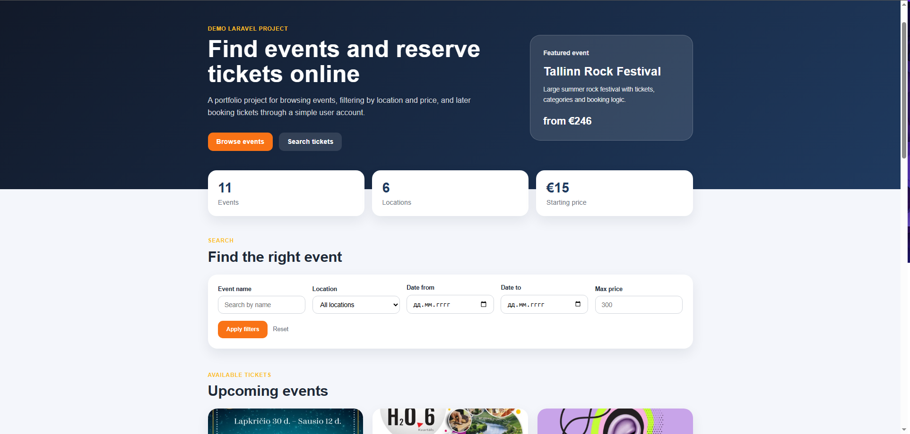
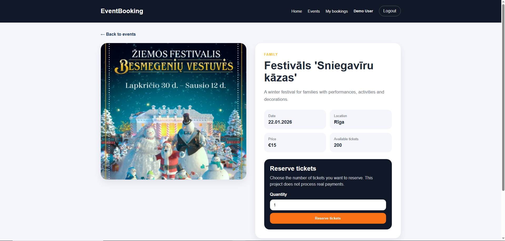
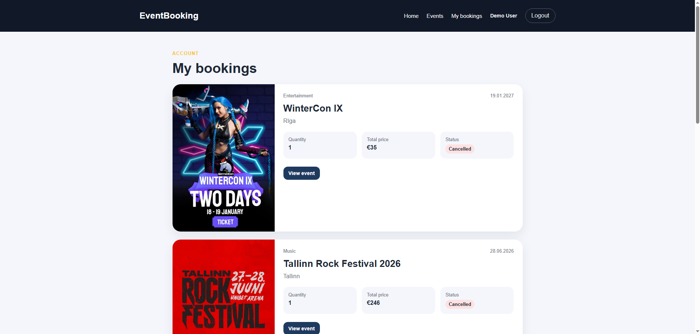
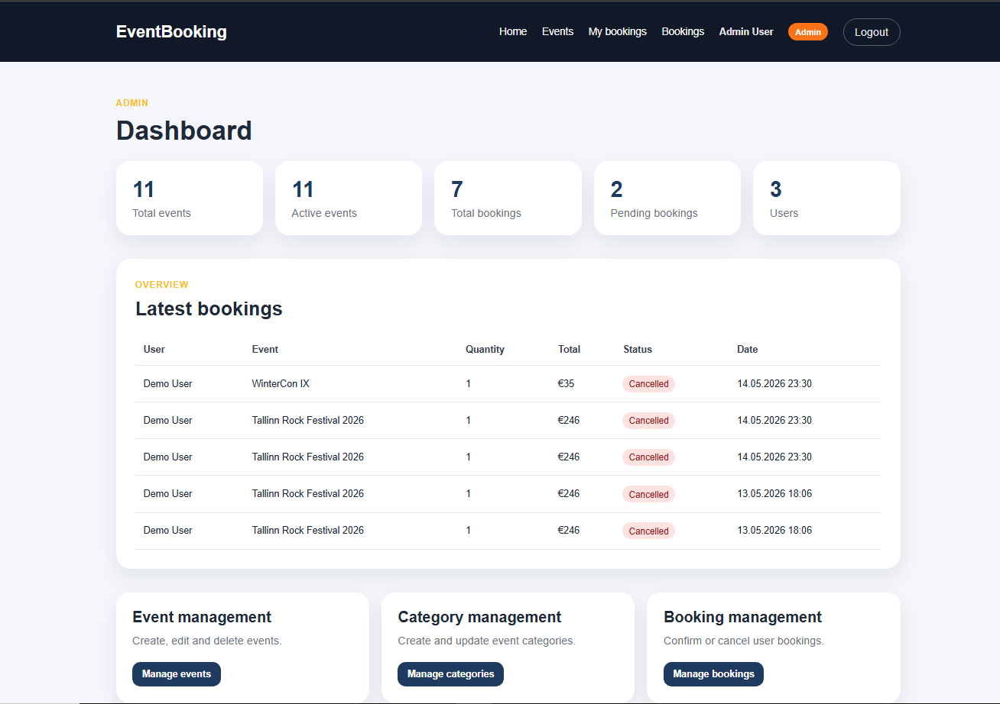
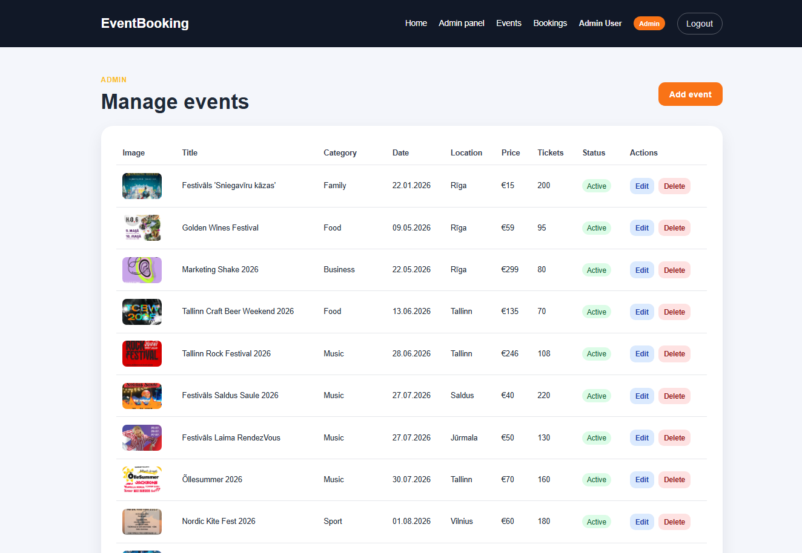
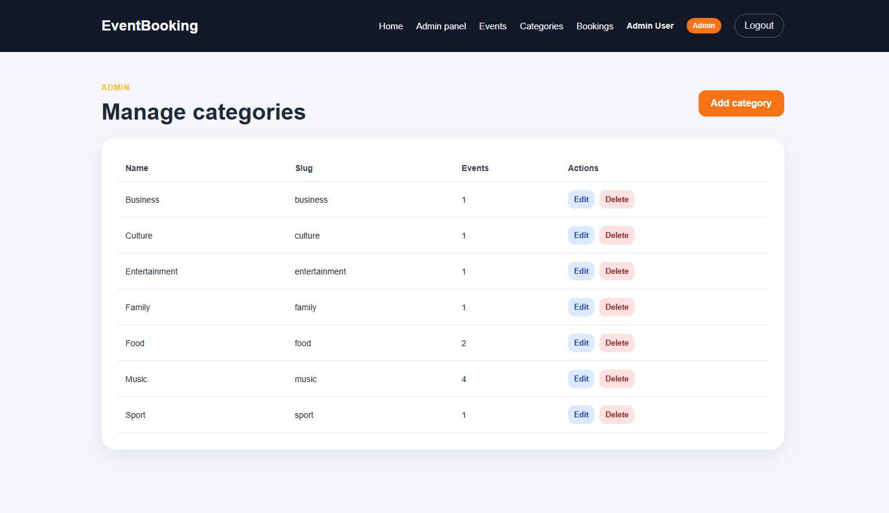
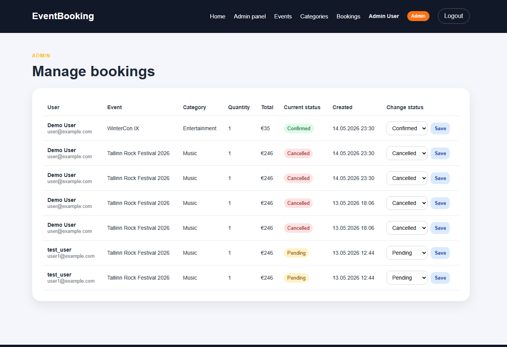

# Event Booking Platform

Event Booking Platform is a Laravel portfolio project for browsing events and reserving tickets online.

The project was created as a demo web application for internship and junior web development portfolio purposes. Real payments are not implemented. Ticket reservation is used only as demo functionality.

## Features

### Public users

- View event catalog
- Search events by name
- Filter events by location, date and price
- Open event details page
- Register and log in
- Reserve tickets for events
- View personal bookings
- Cancel personal bookings

### Admin users

- View admin dashboard
- Manage events
- Create, edit and delete events
- Activate or deactivate events
- Manage categories
- Create, edit and delete categories
- View all bookings
- Change booking status:
  - pending
  - confirmed
  - cancelled

## Technologies Used

- PHP
- Laravel
- MySQL
- Blade
- HTML
- CSS
- Git
- GitHub

## Screenshots

### Home page

### Home page



### Event details



### My bookings



### Admin dashboard



### Admin events



### Admin categories



### Admin bookings



## Demo Accounts

### Admin account

```text
Email: admin@example.com
Password: password
```

### User account

```text
Email: user@example.com
Password: password
```

## How to Run Locally

Clone the repository:

```bash
git clone https://github.com/vadims-baranovskis/event-booking-platform.git
cd event-booking-platform
```

Install PHP dependencies:

```bash
composer install
```

Install frontend dependencies:

```bash
npm install
```

Create environment file:

```bash
cp .env.example .env
```

Generate application key:

```bash
php artisan key:generate
```

Configure database in `.env`:

```env
DB_CONNECTION=mysql
DB_HOST=127.0.0.1
DB_PORT=3306
DB_DATABASE=event_booking_platform
DB_USERNAME=root
DB_PASSWORD=
```

Run migrations and seeders:

```bash
php artisan migrate --seed
```

Start local server:

```bash
php artisan serve
```

Or open the project through Laravel Herd:

```text
http://event-booking-platform.test
```

## Database Structure

Main tables:

- users
- categories
- events
- bookings

Main relationships:

- Category has many events
- Event belongs to category
- User has many bookings
- Event has many bookings
- Booking belongs to user
- Booking belongs to event

## Main Pages

Public pages:

```text
/
 /events/{event}
/login
/register
/my-bookings
```

Admin pages:

```text
/admin/dashboard
/admin/events
/admin/categories
/admin/bookings
```

## Project Status

The main functionality is implemented:

- event catalog
- event details page
- authentication
- ticket booking
- user bookings page
- admin dashboard
- event management
- category management
- booking status management

## Notes

This project does not process real payments.

All bookings are stored only as demo reservations in the database.